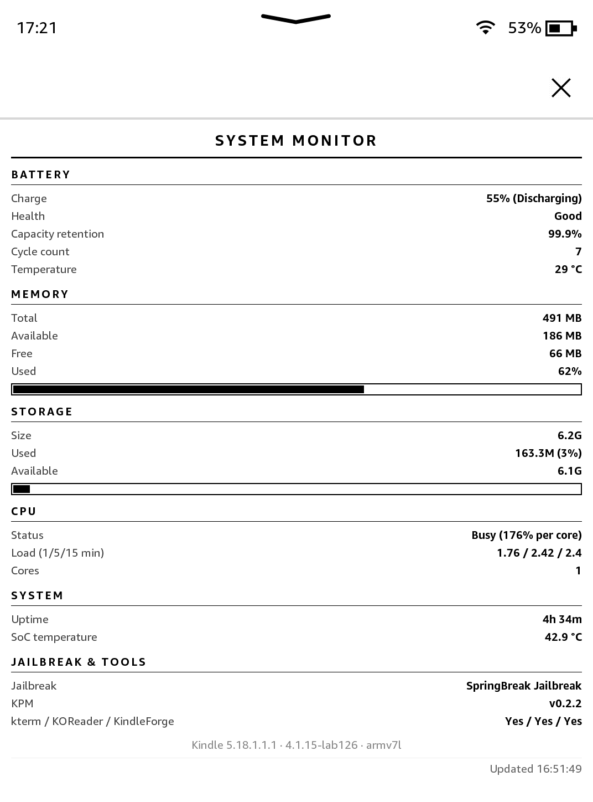

# sysmon

Live battery, memory, storage, CPU and jailbreak/tools status for a
jailbroken Kindle — a [KPM](https://github.com/KindleModding/KPM) package,
no server required, everything runs on-device.



## Install

Requires KPM (modern jailbreaks ship with it pre-installed). From `kterm`:

```
KPM=/var/local/kmc/bin/kpm
$KPM add-repo https://nealing.net/manifest.json
$KPM -y update
$KPM -y install sysmon
$KPM launch sysmon
```

(From the search bar instead, type each line separately as `;kpm ...` — see
[Install details](#install-details) for why the commands differ slightly.)

`https://nealing.net/manifest.json` is this author's combined repo — it also
has [dropbear-ssh](https://github.com/akshaylahudkar/dropbear-ssh). The old
`sysmon.nealing.net/manifest.json` URL still works too, it just redirects
here now.

## What it shows

- **Battery**: charge %, health, capacity retention (actual vs. design
  full-charge capacity — a real wear indicator, not just charge %), cycle
  count, temperature.
- **Memory**: total/available/free + a usage bar.
- **Storage**: `/mnt/us` size/used/available + a usage bar.
- **CPU**: load average translated into a plain Idle/Normal/Busy/Overloaded
  label (not just raw load-average numbers), plus the raw 1/5/15-min values.
- **System**: uptime, SoC temperature (separate from battery temperature).
- **Jailbreak & tools**: which jailbreak is installed, KPM version, whether
  kterm/KOReader/KindleForge are present.

Refreshes every 4 seconds for up to ~20 minutes per launch via a background
loop — relaunch the app to reset that window.

<details>
<summary><strong id="install-details">Install details</strong></summary>

- **KPM itself**: modern jailbreaks ship with it pre-installed — try
  `;kpm update` from the search bar to check. If you're on an older
  jailbreak without it, see the [KPM project](https://github.com/KindleModding/KPM)
  for current install instructions (not duplicated here since they're
  liable to change).
- **Why `kterm` needs the full path**: KPM's own installer never puts `kpm`
  on your `PATH`, so bare `kpm` fails with `not found` there. The search
  bar's own `;kpm` wiring resolves the path for you already, so no full path
  needed for that one.
- **What `nealing.net` is**: a Cloudflare Worker that transparently proxies
  this author's repos' `manifest.json`/`.kpkg` files straight from GitHub —
  shorter to type than the raw GitHub URL, and (same fix used for this
  author's `dropbear-ssh` package) routes around cases where a Kindle's
  network can reach Cloudflare but not GitHub's raw-content CDN directly.
  The full URL,
  `https://raw.githubusercontent.com/akshaylahudkar/sysmon/main/repo-manifest.json`,
  still works too if you'd rather see exactly where you're pointing before
  typing a domain you don't recognize.
- **Official KPM repo**: not submitted yet — planned once this has more than
  one device confirming it works.
</details>

<details>
<summary><strong>What's verified, what isn't</strong></summary>

Tested end-to-end (install → launch → live data → uninstall, via the real
KPM flow) on a **Kindle PaperWhite 4**.

- **Memory and CPU** use standard Linux `/proc` interfaces (`/proc/meminfo`,
  `/proc/loadavg`) — these should work identically on any Kindle generation
  running Linux, jailbreak or firmware version aside.
- **Storage** uses `df`, also a standard interface.
- **Battery charge/status/health** auto-detects the `power_supply` entry by
  `type=Battery` rather than hardcoding a chip name, so this should read
  correctly across most Kindle generations even though this device's PMIC
  (`bd71827`) may differ from others'.
- **Battery capacity retention and cycle count** depend on the specific
  sysfs attribute names (`charge_full`, `charge_full_design`,
  `cycle_count`) existing under that same entry — confirmed present on this
  PW4's PMIC, not verified on other chips. Falls back to `--` rather than
  crashing if they're missing.
- **Jailbreak name** reads `/var/local/jailbreak.txt`, a marker file written
  by the jailbreak installer itself (confirmed read the same way by this
  device's own `patch_system.sh`) — this should be jailbreak-generic rather
  than tied to one specific jailbreak variant, but only actually verified
  against one (SpringBreak).

If retention/cycle count or the jailbreak name show `--`/`null` on your
device, that's the known-unverified path — open an issue with your device
model, PMIC name (`ls /sys/class/power_supply/`), and jailbreak.
</details>

<details>
<summary><strong>Why a background loop instead of a real server</strong></summary>

This device's busybox doesn't have the `httpd` applet compiled in, so there's
no easy way to run a local status server the page could poll live. Instead,
`launch.sh` starts a loop that rewrites a `status.json` file in the app's own
directory every 4 seconds, and the page polls that same-directory file via
XHR. The loop is bounded to 300 iterations (~20 minutes) so it can't become
an orphaned background process if the app is closed by navigating away
rather than a clean shutdown signal there's no reliable way to catch.
</details>
